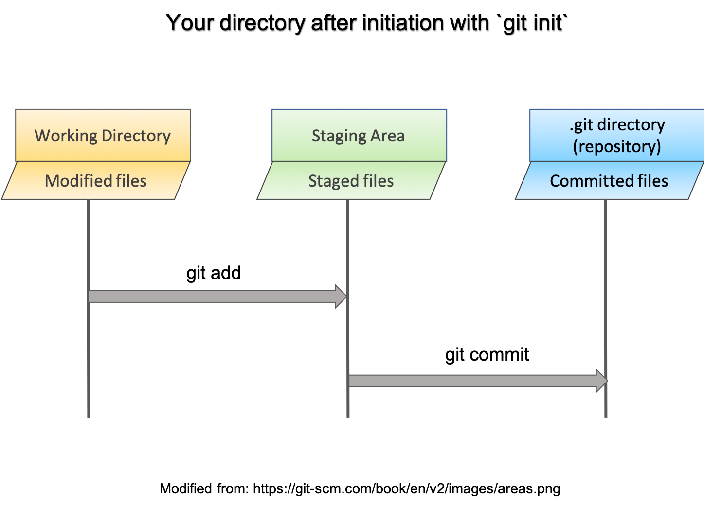

# Software Carpentry Workshop

## Lesson 3: Introduction to Git and Github
This lesson is based on [this Software Carpentry lesson](https://swcarpentry.github.io/git-novice/)

#### Please make sure your directory structure is setup as described [here](https://github.com/uta-carpentries/SoftwareCarpentryWorkshops_general/blob/master/Data_DirectoryStructure_Setup.md)

Learning Objectives:
* Understanding Git and its structure
* Practical use of Git and Git commands
* Integration of Git with Github
* Using Github for collaborative work


Additional resources:
[tutorials](https://www.atlassian.com/git/tutorials)
[pull requests](https://help.github.com/articles/creating-a-pull-request-from-a-fork/)

## 1. What is Git/GitHub and why you would want to use it

Does this look familiar?


**Git**
Git is a version control software. It is used to track changes in documents on your local machine. All file versions and revision history are saved to a folder known as **repository**.

Version control systems start with a base version of the document and then save just the changes you made at each step of the way. You can think of it as a tape: if you rewind the tape and start at the base document, then you can play back each change and end up with your latest version.


Once you think of changes as separate from the document itself, you can then think about “playing back” different sets of changes onto the base document and getting different versions of the document. For example, two users can make independent sets of changes based on the same document.


Unless there are conflicts, you can combine two sets of changes onto the same base document.


**Github** is a cloud service that hosts repositories, it is a central hub to hold all our local repositories. Github has additional functionality that enables efficient collaboration.


As you can see, there are many ways users can interact with remote repositories. The main advantage here is to have access to repositories other than your own, a framework that promotes collaboration. Before exploring Github, let's understand how to make repositories and track files on your local machines.

## 2. Setting up Git

Git should be already installed on your machines. If you are on Windows, Git came with your gitbash installation. If you are on Mac, Git has been preinstalled on your system.


When we use Git on a new computer for the first time, we need to configure a few things. Below are a few examples of configurations we will set as we get started with Git:

- our name and email address,
- what our preferred text editor is,
- and that we want to use these settings globally (i.e. for every project)

On a command line, Git commands are written as `git verb`, where `verb` is what we actually want to do. 
```shell
$ git config --global user.name "Your username"
$ git config --global user.email "Your email" 

###add a text editor of your choice (we use Sublime in our workshop)

##Sublime:  
#Mac:
$ git config --global core.editor "/Applications/'Sublime Text.app'/Contents/SharedSupport/bin/subl -n -w"

#Windows: 
$ git config --global core.editor "'C:\Program Files\Sublime Text 3\sublime_text.exe' -n -w"

#If it is on your path already:
$ git config --global core.editor "subl -w -n"

#Mac: Text Wrangler
$ git config --global core.editor "edit -w"

#Windows: notepad
$ git config --global core.editor "notepad"

#Windows: notepad++
$ git config --global core.editor "'C:\Program Files (x86)\Notepad++\notepad++.exe'"

#Linux
$ git config --global core.editor "nano"
```
The commands we just ran above only need to be run once: the flag --global tells Git to use the settings for every project, in your user account, on this computer.

You can check your settings at any time:
```shell
$ git config --list
```
`git config` command has other options. You can get help with this and other git commands by typing
```shell
$ "YourCommand" -h
$ git config -h
$ git config --help
```
So far we have only used `git config` command, but there are many more. You can get an idea about the functionality of Git by taking a look at the available commands.
```shell
$ git
```
We will explore some of them next.

## 3. Track your documents with Git

We are now ready to use Git.
To start with, let's make a new folder `project_git` on your Desktop, outside `SCW` directory.
```bash
$ cd ~/Desktop
$ mkdir project_git
```
Now create a file, `notes.txt` inside `project_git`. 

```shell
#go to project_git
$ cd project_git

#make empty notes.txt
$ touch notes.txt

#open with Sublime:
$ subl notes.txt

#Add text: "My notes about git:"
#Save and close.

#Check contens of this file
$ cat notes.txt

#check project_git contents
$ ls -aF 
./  ../ notes.txt
```
We can ask now if our new file, `notes.txt` is being tracked. We can do this with `git status` command
```shell
$ git status
fatal: Not a git repository (or any of the parent directories): .git
```
This message means that `project_git` folder is not under the control of Git, none of the documents within this folder are being tracked.

To place a folder under Git control, we need to initialize `project_git` folder.

```shell
#check that you are in project_git
$ pwd

#initialize project_git directory with Git
$ git init
Initialized empty Git repository in ...

#check content
$ ls -aF
./  ../  .git/  notes.txt
```
The folder that contains .git directory is called ***repository***




  

Let's try `git status` command now.
```
$ git status
On branch master

No commits yet

Untracked files:
  (use "git add <file>..." to include in what will be committed)

        notes.txt

nothing added to commit but untracked files present (use "git add" to track)
```
You can see that initializing a directory makes it visible to Git. Now Git tells us what files are in the directory and what is their status. In our case, Git says that there is `notes.txt` file and it is untracked. Git also tells us that we need to use `git add` command to start tracking this file.
```
$ git add notes.txt

$ git status
On branch master

No commits yet

Changes to be committed:
  (use "git rm --cached <file>..." to unstage)

        new file:   notes.txt
```
The current version of `notes.txt` is now ready (or staged) to be recorded by Git. To record the current version of `notes.txt`, `git commit` command is used
```
#commit changes
$ git commit -m "first note"

[master (root-commit) 851e745] first note
 1 file changed, 1 insertion(+)
 create mode 100644 notes.txt
```
When we run `git commit`, Git takes everything we have told it to save by using `git add` and stores a copy permanently inside the special `.git` directory. This permanent copy is called a **commit** (or revision) and its short identifier is 851e745 (Your commit may have another identifier.)

We use the -m flag (for “message”) to record a short, descriptive, and specific comment that will help us remember later on what we did. If we just run `git commit` without the -m option, Git will launch Sublime editor (or whatever other editor you configured as core.editor) so that we can write a longer message.

Good commit messages start with a brief (<50 characters) summary of changes made in the commit. If you want to go into more detail, add a blank line between the summary line and your additional notes.

To change your commit message, you can use `git commit --amend`.

Now run `git status` again. 
```
#check satus
$ git status
On branch master
nothing to commit, working tree clean
```
Everything is up-to-date!

You can check the history of your commits:
```
$ git log

commit 851e745b2d4c72541cce750ba1d19d6b3d59ee6a
Author: AnnaWilliford <awillifo@uta>
Date:   Thu Nov 2 13:29:28 2017 -0500

    first note 
    
#or for a condensed view
$ git log --oneline
```
In summary, here are the steps that must be completed to track changes in your documents with Git.

- [x] Initialize your folder with `git init` command. This is done only **one** time for every new parent directory
- [x] Prepare new/modified files for saving(committing) with `git add` command
- [x] Create a permanent copy of your new/modified file with `git commit -m "message" `


 **Challenge**
```
 Open notes.txt in text editor and record commands that you need to execute in order to:
 1. turn a new folder into git repository, 
 2. track changes to a file with Git. 
 Save your changes and commit your changes with Git. You can use "added git commands" as your commit message 
```
>**Solution**
>
> Open `notes.txt` (with `subl notes.txt`), add text, save and close.  
>
> You can see your new `notes.txt` with `cat` command:   
> $ cat notes.txt  
> ```
> My notes about git:
> 1. git init
> 2. git add -all
> 3. git commit -m "added git commands"
> ```
> 
> $ git status  
> On branch master  
> Changes not staged for commit:  
> (use "git add <file>..." to update what will be committed)  
> (use "git checkout -- <file>..." to discard changes in working directory)  
>
>    modified:   notes.txt  
>
> no changes added to commit (use "git add" and/or "git commit -a")  
>
> $ git add notes.txt  
> $ git commit -m "added git commands"  

Now, run `git log`.  The output of `git log` tells you the history of your changes. Your commit messages are very important, in case you want to restore an old version of the document, they will help you to pick out the version you want.

Your versions (or commits) have unique identifiers. In addition, the most recent version can be identified by `HEAD`. You can see differences between any 2 versions by using `git diff` command:
```shell
#you can specify only first few characters of the commit identifier.
$ git diff 851e745b2 HEAD notes.txt
```


## 4. Accessing older versions

The clear advantage of tracking your documents with Git is that you can always go back to the previous version. Let's see how this works.

The output of `git log` provides all the information you need to retrieve the older version of the document.

In our case, we have two versions of `notes.txt`:

```
$ git log 

commit 0d19d524b547467f2eaccb4840449ce0d9e02588 (HEAD -> master)
Author: =AnnaWilliford <awillifo@uta.edu>
Date:   Wed Sep 11 12:18:14 2019 -0500

    added git commands

commit 760f2f26c22ff8f7838a2e05154e8b7a5703111c
Author: =AnnaWilliford <awillifo@uta.edu>
Date:   Wed Sep 11 11:50:39 2019 -0500

    added notes.txt

```

Suppose that you want the original version of `notes.txt`. How would you do that?

To restore any of the original versions of a file, you use `git checkout` command:
```
#general syntax
$ git checkout <commitID> <file>
```

If we want the original `notes.txt`:
```
#see what commitID is associated with the original version
git log --oneline

#the commit that includes original file has message "added notes.txt" (or whatever you used when you committed the change)
$ git checkout ad91ea0aab notes.txt

#Note: your commitID will be different
```

Now let's make sure that we have original version of `notes.txt`
```
#view restored version
$ cat notes.txt

#restored version has not been committed, see HEAD commit
$ git log

#see what to do next
$ git status

#If you decide to go ahead with restoring file, commit the change since checkout command places file in the staging area (no need for 'git add')

$ git commit -m "changed to the original notes.txt version"

$ git status

#see HEAD now
$ git log
```

If you run git checkout, but would like to cancel restoring the old version, do this before committing original version:
```
#unstage restored file
$ git reset HEAD notes.txt 

#return to latest version before you attempted to restore the file
$ git checkout -- notes.txt

#see current file
$ cat notes.txt
```

If you want to return to a previous snapshot (version) of your project and remove all commits after a certain commit:

```
#revert to a state identified by <commitID>
$ git reset <commitID>

#check commit history
$ git log
```

## 5. GitHub: share your repository with the world

So far, our work was restricted to the local machine. But if you want to share your repositories with your colleagues, it would be nice to have a central place where everyone could make their repositories available for comments/suggestions/collaborations. Github is a service that allows us to do that. It is also nice to have access to your project from anywhere, not just from your own computer.   

You have SCW directory on the desktop with all the files you created during the workshop. Let's add SCW folder to your GitHub account. How would you do that?  

Notice that so far, we worked with a folder we created from scratch. Now, let's see how to turn an existing directory (`SCW`) into git repository. How will you place this directory under Git control?

```
#Go to SCW
$ cd ~/Desktop/SCW

#initialize
$ git init

#check status
$ git status

#prepare files for tracking
$ git add --all

#commit changes 
$ git commit -m "init SCW with Git"

#check commit history
$ git log
```
Now every file in this directory is being tracked.   

Notice that we added multiple folders and files in the same commit. If you want to know what files were included in this commit:
```
# print the list of files that are part of a given commit
$ git show --name-only 1e228d70f
```

Now our `SCW` is ready to be added to GitHub.

**If you have not created Github account, please go to github.com and do it now.**

Now we want to create repository that will be a remote copy of our local `SCW` repository. 
```
#from your github account:
Click on 'new repository'
Repository name: 'SCW'
Type: public
Click on 'create repository'
```
You have just created remote empty `SCW` repository. This repository has a specific identifier URL associated with it. We now let our local machine know that we have a remote location for our local repository.
```
#on your local machine
$ git remote add origin URL
#in my case:
#$ git remote add origin https://github.com/AnnaWilliford/SCW.git
```
The name origin is a local nickname for your remote repository. We could use something else if we wanted to, but origin is by far the most common choice.

Once the nickname origin is set up, `git push` command will push the changes from our local repository to the repository on GitHub:
```
$ git push -u origin master
```
This is it! You just made your local 'SCW' repository available on GitHub to everyone. You are now in position to share your work and collaborate with others. How cool is this?

---


---

**Challenge**
```
Suppose you want to add another file to your repository.
Copy notes.txt from Desktop/project_git folder to SCW/Lesson3_Git_GitHub folder. Add this file to your local repository (git add, git commit)
and then push (git push) it to GitHub.

**NOTE** You can only have one .git folder in the root directory of the project. Do not copy project_git folder, just notes.txt
```
> **Solution**
>  
> ```
> #make sure you are inside SCW directory on your local machine
> $ cp ~/Desktop/project_git/notes.txt Lesson3_Git_GitHub/
> $ git add -all
> $ git commit -m "added notes.txt to Lesson3_Git_GitHub"
>
> #make sure that everything is up to date:
> $ git status
> 
> #push to GitHub
> $ git push
> ```

## 6. Working with repositories created by others 

If you find an interesting repository on GitHub, you can copy it to your own GitHub account or to your own computer. This is also the first step to take if you want to conribute to projects created by other people.   

Here is a repository that might be of interest to you:  
https://github.com/uta-carpentries/SWC_Fall2019

This repository contains Lessons for this workshop. You can just visit our repository and remind yourselves about what we did or you can copy this repository to your own GitHub account.  

**To copy to your GitHub account**, create a **fork**  by clicking `fork` button on the top right corner of the page.  

You should now have a new repository called `SWC_Fall2019` in **YOUR** account. This is great, you can copy other projects/repositories to your Github account!  

**To copy to your local machine**, use `git clone` command. Let's copy `uta-carpentries/SWC_Fall2019` to your desktop:

```
$ git clone https://github.com/uta-carpentries/SWC_Fall2019.git ~/Desktop/SWC_Fall2019.git
```
You now have all lessons from this workshop both in your GitHub account and on your local machine!  
You can have access to any public repository on GitHub in a similar way.

