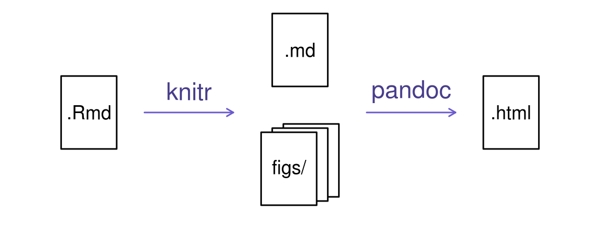

# Software Carpentry Workshop

## Lesson6: Reproducible research 
This lesson is based on [this Software Carpentry lesson](https://swcarpentry.github.io/r-novice-gapminder/15-knitr-markdown/)

#### Please make sure your directory structure is setup as described [here](https://github.com/uta-carpentries/SoftwareCarpentryWorkshops_general/blob/master/Data_DirectoryStructure_Setup.md)

## Introduction
Documenting and sharing the progress and results of data analysis is one of the most important aspects of data analysis and scientific inquiry. However, if you have had to produce reports of your data analysis progress, through emails, MS Word documents, or even scientific papers, you know the traditional methods and tools for documenting data analysis are poorly suited to this task. Today, we will be working with a powerful `R` package called `knitr`, which integrates a project narrative with the code and output (includig plots) of data analysis, all within a portable and easily read `html` document. This can be readily shared with others and fosters an open, reproducible method for documenting the progress and results of your work.

## Objectives
- Value of reproducible reports
- Basics of Markdown
- R code chunks
- Chunk options
- Inline R code
- Other output formats
#### Keypoints
- "Mix reporting written in R Markdown with software written in R."
- "Specify chunk options to control formatting."
- "Use `knitr` to convert these documents into PDF and other formats."
source: Rmd
---

## Data analysis reports

Data analysts tend to write a lot of reports, describing their analyses and results, for their collaborators or to document their work for future reference.

When I was first starting out, I'd write an R script with all of my work, and would just send an email to my collaborator, describing the results and attaching various graphs. In discussing the results, there would often be confusion about which graph was which.

I moved to writing formal reports, with Word or LaTeX, but I'd have to spend a lot of time getting the figures to look right. Mostly, the concern is about page breaks.

Everything is easier now that I create a web page (as an html file). It can be one long stream, so I can use tall figures that wouldn't ordinary fit on one page. Scrolling is your friend.


## Literate programming

Ideally, such analysis reports are _reproducible_ documents: If an error is discovered, or if some additional subjects are added to the data, you can just re-compile the report and get the new or corrected results (versus having to reconstruct figures, paste them into a Word document, and further hand-edit various detailed results).

The key tool for R is [knitr](http://yihui.name/knitr/), which allows you to create a document that is a mixture of text and some chunks of code. When the document is processed by knitr, chunks of R code will be executed, and graphs or other results inserted.

This sort of idea has been called "literate programming".

knitr allows you to mix basically any sort of text with any sort of code, but we recommend that you use R Markdown, which mixes Markdown with R. Markdown is a light-weight mark-up language for creating web pages.


## Creating an R Markdown file

**Please copy `gapminder.txt` to `Lesson6_ReproducibleResearchR` folder**

Within R Studio, click File &rarr; New File &rarr; R Markdown and you'll get a dialog box like this:


You can stick with the default (HTML output), but give it a title.


## Basic components of R Markdown

The initial chunk of text contains instructions for R: you give the thing a title, author, and date, and tell it that you're going to want to produce html output (in other words, a web page).

```
---
title: "Initial R Markdown document"
author: "Balan Ramesh"
date: "September 11, 2019"
output: html_document
---
```

You can delete any of those fields if you don't want them included. The double-quotes aren't strictly _necessary_ in this case. They're mostly needed if you want to include a colon in the title.

RStudio creates the document with some example text to get you started. Note below that there are chunks like


`` ``` ``{r cars}  
summary(cars)  
`` ``` ``

These are chunks of R code that will be executed by knitr and replaced by their results. More on this later.

Also note the web address that's put between angle brackets (`< >`) as well as the double-asterisks in `**Knit**`. This is [Markdown](http://daringfireball.net/projects/markdown/syntax).

## Markdown

Markdown is a system for writing web pages by marking up the text much as you would in an email rather than writing html code. The marked-up text gets _converted_ to html, replacing the marks with the proper html code.

For now, let's delete all of the stuff that's there and write a bit of markdown.

You make things **bold** using two asterisks, like this: `**bold**`, and you make things _italics_ by using underscores, like this: `_italics_`.

You can make a bulleted list by writing a list with hyphens or asterisks, like this:

```
* bold with double-asterisks
* italics with underscores
* code-type font with backticks
```

or like this:

```
- bold with double-asterisks
- italics with underscores
- code-type font with backticks
```

Each will appear as:

- bold with double-asterisks
- italics with underscores
- code-type font with backticks


You can make a numbered list by just using numbers. You can use the same number over and over if you want, but make sure you have a space between the dot and your list item!

```
1. bold with double-asterisks
1. italics with underscores
1. code-type font with backticks
```

This will appear as:

1. bold with double-asterisks
1. italics with underscores
1. code-type font with backticks

You can make section headers of different sizes by initiating a line
with some number of `#` symbols:

```
# Title
## Main section
### Sub-section
#### Sub-sub section
```

You _compile_ the R Markdown document to an html webpage by clicking the "Knit HTML" in the upper-left. And note the little question mark next to it; click the question mark and you'll get a "Markdown Quick Reference" (with the Markdown syntax) as well to the RStudio documentation on R Markdown.

**Challenge**
```
Create a new R Markdown document. Delete all of the R code chunks and write a bit of Markdown (some sections, some italicized text, and an itemized list).
Convert the document to a webpage with `knit` button .
```
## A bit more Markdown

You can make a hyperlink like this:
`[text to show](http://the-web-page.com)`.

You can include an image file like this: ``


## R code chunks

Markdown is interesting and useful, but the real power comes from mixing markdown with chunks of R code. This is R Markdown. When processed, the R code will be executed; if they produce figures, the figures will be inserted in the final document.

The main code chunks look like this:


`` ``` ``{r load_data}  
gapminder<-read.table("gapminder.txt", header = TRUE)
head(gapminder)  
`` ``` ``

That is, you place a chunk of R code between <code>&#96;&#96;&#96;{r chunk_name}</code> and <code>&#96;&#96;&#96;</code> . It's a good idea to give each chunk a name, as they will help you to fix errors and, if any graphs are produced, the file names are based on the name of the code chunk that produced them.

**Challenge**
```
Add code chunks to
- Load the ggplot2 package
- Read the gapminder data and show first few lines of the dataset
- Create a plot
```
**Solution**
> `` ``` ``{r load_ggplot2}  
> library(ggplot2)   
> `` ``` ``
>
> `` ``` ``{r load_gapminder}  
> gapminder<-read.table("gapminder.txt", header = TRUE)  
> head(gapminder)  
> `` ``` ``
>
> `` ``` ``{r make_plot}  
> ggplot(data=gapminder, aes(x = gdpPercap, y = lifeExp, color=continent)) +geom_point()  
> `` ``` ``

## How things get compiled

When you press the "Knit HTML" button, the R Markdown document is processed by [knitr](http://yihui.name/knitr) and a plain Markdown document is produced (as well as, potentially, a set of figure files): the R code is executed and replaced by both the input and the output; if figures are produced, links to those figures are included.

The Markdown and figure documents are then processed by the tool [pandoc](http://pandoc.org/), which converts the Markdown file into an html file, with the figures embedded.




## Chunk options

There are a variety of options to affect how the code chunks are treated.

- Use `echo=FALSE` to avoid having the code itself shown.
- Use `results="hide"` to avoid having any results printed.
- Use `eval=FALSE` to have the code shown but not evaluated.
- Use `warning=FALSE` and `message=FALSE` to hide any warnings or
  messages produced.
- Use `fig.height` and `fig.width` to control the size of the figures
  produced (in inches).

So you might write:

`` ``` ``{r subset gapminder, echo=FALSE}  
Canada=gapminder[gapminder$country=="Canada",]  
Canada  
`` ``` ``  
In the above example, code is evaluated, but not shown.  

Or:  
`` ``` ``{r subset gapminder, eval=FALSE}  
Canada=gapminder[gapminder$country=="Canada",]  
Canada  
`` ``` ``  
In this example, code is shown, but not executed.  


## Inline R code

You can make _every_ number in your report reproducible.   
Use <code>&#96;r</code> and <code>&#96;</code> for an in-line code chunk. Don't let these in-line chunks get split across lines.

For example:
```
The mean of life expectancy column is `r mean(gapminder$lifeExp)`. 
```
The code will be executed and replaced with the _value_ of the result:
```
The mean of life expectancy column is 59.4744394.
```


## Other output options

You can also convert R Markdown to a PDF or a Word document. Click the little triangle next to the "Knit HTML" button to get a drop-down menu. Or you could put `pdf_document` or `word_document` in the header of the file.


## Time for practice!

**Here is your task:**  
```
Write `RprogrammingTask.Rmd` explaining how you would approach the following task.
"For every unique country in gapminder dataset, if country name starts with 'Ma', use ggplot2 package 
to plot life expectancy(y axis) over years(x axis)."

Use markdown text to break the problem into multiple steps (in English first). 
Then try to implement each step in R by adding code chunks.
```
**Solution**
See [RprogrammingTask.Rmd](RprogrammingTask.Rmd)

## Resources

- [Knitr in a knutshell tutorial](http://kbroman.org/knitr_knutshell)
- [Dynamic Documents with R and knitr](http://www.amazon.com/exec/obidos/ASIN/1482203537/7210-20) (book)
- [R Markdown documentation](http://rmarkdown.rstudio.com)
- [R Markdown cheat sheet](http://www.rstudio.com/wp-content/uploads/2015/02/rmarkdown-cheatsheet.pdf)
- [Getting started with R Markdown](https://www.rstudio.com/resources/webinars/getting-started-with-r-markdown/)
- [Reproducible Reporting](https://www.rstudio.com/resources/webinars/reproducible-reporting/)
- [The Ecosystem of R Markdown](https://www.rstudio.com/resources/webinars/the-ecosystem-of-r-markdown/)
- [Introducing Bookdown](https://www.rstudio.com/resources/webinars/introducing-bookdown/)
